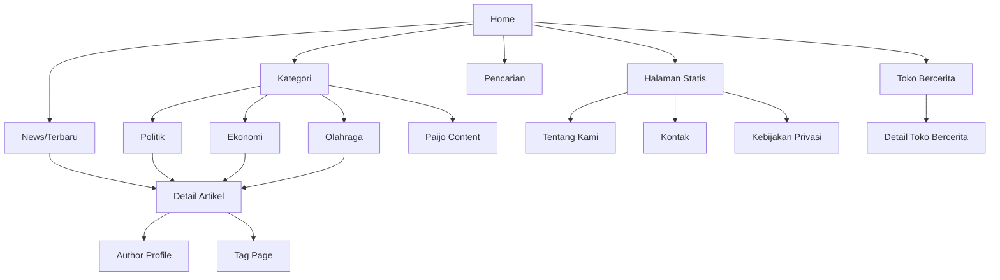

# Product Requirements Document (PRD): Portal Berita Modern

## 1. Executive Summary

**Ringkasan Produk:**
Portal Berita Modern ini adalah platform berita digital mutakhir berskala nasional yang dirancang khusus untuk kecepatan, efisiensi SEO, dan skalabilitas. Menggunakan arsitektur "Headless", sistem ini memisahkan backend manajemen konten (WordPress) dengan frontend presentasi (Next.js App Router).

**Problem Statement:**
Portal berita tradisional yang berjalan pada sistem monolitik (seperti tema WordPress standar) sering kali menghadapi masalah lambatnya waktu pemuatan halaman (page load), kerentanan keamanan, kurangnya fleksibilitas UI/UX yang modern, serta sulitnya penskalaan (scaling) ketika menghadapi lonjakan traffic berita *breaking news*. 

**Solution Overview:**
Mengadopsi arsitektur Headless CMS. Menggunakan WordPress hanya untuk *Content Management* (menjaga familiaritas alur kerja editorial), sementara Frontend dibangun dengan Next.js App Router. Penggunaan Next.js memungkinkan Server-Side Rendering (SSR) dan Static Site Generation (SSG) mutakhir, dipadukan dengan Tailwind CSS dan Shadcn UI untuk antarmuka yang dinamis, ringan, dan modern.

**Business Value:**
* **Kecepatan & Retensi:** Waktu muat (load time) < 2 detik akan mengurangi *bounce rate* secara drastis.
* **SEO Superior:** Memperoleh Core Web Vitals yang sempurna untuk mendukung peringkat pencarian Google yang lebih baik.
* **Peluang Monetisasi:** Performa cepat mencegah *ad-blocker timeout* dan memastikan iklan termuat lebih cepat.

---

## 2. Product Vision

**Vision:**
Menjadi portal berita digital paling responsif, akurat, dan dapat diandalkan di Indonesia yang menawarkan pengalaman membaca tanpa batas untuk jutaan masyarakat.

**Mission:**
Menyediakan infrastruktur media digital modern yang memberdayakan jurnalis untuk mempublikasikan berita secara instan, dan memberikan pengalaman membaca yang cepat, intuitif, dan bebas gangguan bagi para pembaca.

**Long-term goals:**
* Mencapai dan mempertahankan angka 1.000.000+ *pageviews* per bulan di tahun pertama.
* Menjadi *top of mind* pembaca lokal dengan tingkat retensi (returning visitor) di atas 40%.
* Menghadirkan ekosistem fitur canggih termasuk personalisasi berita menggunakan AI.

---

## 3. Success Metrics

### KPI Bisnis
* **Monthly Active Users (MAU):** Mencapai 1.000.000 visitor dalam 12 bulan.
* **Ad Revenue:** Peningkatan pendapatan iklan sebesar 30% dari peningkatan *Time on Page*.
* **Bounce Rate:** Berkurang menjadi < 45%.

### KPI Produk
* **Time on Page:** Rata-rata > 2.5 menit.
* **Pages per Session:** > 2.5 halaman per kunjungan.
* **User Registration (Jika ada fitur akun):** > 5.000 pengguna terdaftar di kuartal pertama.

### KPI SEO
* **Organic Traffic Growth:** +15% MoM (Month over Month).
* **Domain Authority:** Peningkatan > 10 poin dalam 6 bulan.
* **Google News Inclusion:** Semua artikel terindeks Google News dalam waktu < 10 menit setelah tayang.

### KPI Performa
* **Lighthouse Score:** > 90 untuk Performance, Accessibility, Best Practices, dan SEO.
* **Largest Contentful Paint (LCP):** < 2.5 detik.
* **First Input Delay (FID) / INP:** < 100 ms.
* **Cumulative Layout Shift (CLS):** < 0.1.

---

## 4. User Personas

### 1. Pembaca (Reader)
* **Tujuan:** Mendapatkan informasi berita terkini, breaking news, dan konten hiburan dengan cepat.
* **Pain Points:** Terlalu banyak iklan yang mengganggu layar (pop-up), website yang memuat sangat lambat, navigasi kategori yang membingungkan.
* **User Needs:** Tampilan bersih, mode gelap (dark mode), fungsi pencarian yang akurat, loading secepat kilat.

### 2. Wartawan (Journalist/Author)
* **Tujuan:** Menulis dan melaporkan berita dari lapangan secara cepat melalui mobile atau desktop.
* **Pain Points:** CMS yang berat saat diakses dari koneksi lambat, editor teks yang tidak responsif, sulitnya mengunggah gambar resolusi tinggi dari HP.
* **User Needs:** Antarmuka penulisan (editor) yang *seamless*, fitur autosave, *media uploader* yang teroptimasi.

### 3. Editor
* **Tujuan:** Meninjau, mengedit, dan mempublikasikan artikel dari wartawan dengan standar kualitas jurnalistik yang tinggi.
* **Pain Points:** Tidak ada sistem revisi (versioning) yang jelas, kurangnya fitur penjadwalan berita, sulit mengkategorikan tag yang sudah ada.
* **User Needs:** Alur kerja editorial (Draft -> Review -> Publish), log aktivitas, manajemen metadata SEO dengan panduan langsung.

### 4. Administrator
* **Tujuan:** Mengelola sistem, hak akses user, struktur menu, dan performa server secara keseluruhan.
* **Pain Points:** Kesulitan memantau error, risiko website *down* ketika ada breaking news (lonjakan traffic).
* **User Needs:** Dashboard monitoring performa, manajemen peran/role yang ketat, kemudahan konfigurasi *cache* (Cloudflare/CDN).

---

## 5. User Stories

1. **As a** Pembaca, **I want** halaman depan dimuat dalam waktu kurang dari 2 detik **So that** saya tidak perlu menunggu lama untuk melihat berita utama.
2. **As a** Pembaca, **I want** dapat membaca artikel tanpa layout yang bergeser (CLS rendah) **So that** saya tidak tidak sengaja mengklik iklan.
3. **As a** Pembaca, **I want** fitur dark mode **So that** mata saya tidak sakit saat membaca di malam hari.
4. **As a** Pembaca, **I want** melihat artikel "Trending News" **So that** saya tahu apa yang sedang hangat dibicarakan.
5. **As a** Pembaca, **I want** fitur pencarian yang instan (search-as-you-type) **So that** saya bisa menemukan topik spesifik secara cepat.
6. **As a** Pembaca, **I want** membaca artikel terkait di bagian bawah halaman **So that** saya dapat terus mengeksplorasi topik yang mirip.
7. **As a** Pembaca, **I want** layout yang responsif 100% di HP **So that** saya bisa membaca dengan nyaman di perangkat apa saja.
8. **As a** Wartawan, **I want** login ke sistem melalui kredensial aman **So that** saya bisa mengakses editor artikel.
9. **As a** Wartawan, **I want** editor blok (Gutenberg) yang mulus **So that** saya mudah menyisipkan foto atau tweet embed.
10. **As a** Wartawan, **I want** artikel tersimpan otomatis saat mengetik **So that** tulisan saya tidak hilang jika koneksi putus.
11. **As a** Wartawan, **I want** status artikel saya terlihat "Pending Review" **So that** saya tahu editor sedang mengeceknya.
12. **As a** Editor, **I want** menerima notifikasi/list draf yang siap direview **So that** saya bisa segera menyuntingnya.
13. **As a** Editor, **I want** mengubah URL slug dan Meta Description **So that** artikel teroptimasi untuk SEO.
14. **As a** Editor, **I want** menjadwalkan artikel terbit besok pagi jam 6 **So that** traffic pagi tidak terlewatkan.
15. **As a** Editor, **I want** menyematkan (pin) artikel tertentu sebagai Headline **So that** artikel tersebut selalu berada di posisi teratas homepage.
16. **As a** Admin, **I want** membatasi akses Wartawan agar tidak bisa menghapus kategori **So that** struktur taksonomi tidak rusak.
17. **As a** Admin, **I want** integrasi dengan sistem CDN (Cloudflare) **So that** gambar dan aset disajikan dari server terdekat.
18. **As a** Admin, **I want** REST API berjalan secara efisien **So that** Frontend Next.js selalu menerima response dengan cepat.
19. **As a** Pembaca, **I want** halaman Tag menampilkan semua artikel spesifik **So that** saya bisa meriset topik khusus (misal: "Pemilu 2024").
20. **As a** Pembaca, **I want** membagikan artikel ke WhatsApp/Twitter dengan tombol share **So that** teman saya bisa membacanya juga.
21. **As a** Pembaca, **I want** URL yang rapi saat dibagikan memunculkan preview gambar (Open Graph) **So that** link terlihat profesional.
22. **As a** Editor, **I want** menambahkan "Breaking News" banner **So that** informasi genting langsung terlihat seluruh pengunjung.
23. **As a** Wartawan, **I want** menambahkan "Toko Bercerita" (Custom Post Type) **So that** saya bisa menulis kolom opini terpisah dari berita harian.
24. **As a** Admin, **I want** webhook/Next.js ISR berjalan setiap artikel di-publish **So that** cache frontend langsung diperbarui.
25. **As a** Pembaca, **I want** halaman "Author Profile" **So that** saya bisa melihat profil penulis dan kumpulan tulisan mereka.
26. **As a** Pembaca, **I want** navigasi breadcrumb **So that** saya tahu di kategori mana artikel yang sedang saya baca.
27. **As a** Pembaca, **I want** gambar-gambar dimuat secara *lazy-loading* **So that** kuota internet saya lebih hemat.
28. **As a** Admin, **I want** mengelola penempatan iklan dari CMS **So that** saya bisa menambah/mengurangi slot tanpa menyentuh kode Frontend.
29. **As a** Pembaca, **I want** melihat waktu baca (read time) pada artikel **So that** saya bisa menimbang apakah saya punya waktu membacanya sekarang.
30. **As a** Editor, **I want** melihat indikator skor SEO (seperti plugin Yoast/RankMath) **So that** kualitas kata kunci terjamin.

---

## 6. Functional Requirements

### ## Public Website (Next.js App Router)

**1. Homepage**
* **Objective:** Menampilkan headline utama, berita terbaru, dan grid kategori secara menarik.
* **Requirement:** Menampilkan Hero Section (Headline), daftar berita terbaru dengan paginasi/infinite scroll, widget trending.
* **Acceptance Criteria:** Header, 5 berita headline, 10 berita terbaru, sidebar sidebar (ads/trending) tampil dengan sempurna.

**2. Detail Artikel**
* **Objective:** Menyajikan konten berita utama dengan jelas.
* **Requirement:** Menampilkan judul, tanggal terbit, nama author, isi artikel kaya format (rich text HTML dari WP), tags, related posts.
* **Acceptance Criteria:** Rich text dirender dengan akurat, *embed* media berjalan, dan iklan terpasang rapi di antara paragraf.

**3. Category Page & Tag Page**
* **Objective:** Menampilkan daftar artikel berdasarkan filter kategori atau tag.
* **Requirement:** Paginasi berita. 
* **Acceptance Criteria:** Menampilkan title kategori, grid berita terbaru dalam kategori tersebut.

**4. Search**
* **Objective:** Menemukan artikel berdasarkan *keyword*.
* **Requirement:** Integrasi pencarian ke WordPress API.
* **Acceptance Criteria:** Hasil relevan muncul dan jika tidak ditemukan, akan ada layar "No Results Found".

**5. Trending & Breaking News**
* **Objective:** Mendorong klik pada berita terpopuler.
* **Requirement:** Ticker/marquee untuk Breaking News di Header. Widget sidebar untuk Trending.
* **Acceptance Criteria:** Editor bisa mencentang artikel sebagai "Breaking" dan otomatis muncul di semua halaman.

**6. Author Page**
* **Objective:** Menunjukkan kredibilitas jurnalis.
* **Requirement:** Halaman biodata profil (nama, avatar, deskripsi) dan daftar tulisannya.
* **Acceptance Criteria:** URL `website.com/author/john-doe` menampilkan list berita oleh John Doe.

### ## CMS Features (WordPress Backend)

**1. CRUD Artikel (Post & Custom Post Type)**
* Manajemen pembuatan, pembaharuan, penghapusan, dan pemulihan berita serta CPT (`paijo_content`, `toko_bercerita`).

**2. Media Management**
* Manajemen gambar terpusat, crop, optimasi WebP/AVIF.

**3. Role Management & Editorial Workflow**
* Kapabilitas User Roles yang terbagi: Contributor, Author, Editor, Administrator.

---

## 7. Non Functional Requirements

### ## Performance
* **Lighthouse Target:** >90 untuk Mobile dan Desktop.
* **Core Web Vitals:** LCP < 2.5s, INP < 100ms, CLS < 0.1.
* **Caching Strategy:** Menggunakan fitur *Incremental Static Regeneration (ISR)* di Next.js (Revalidation per 60 detik) & Edge Caching CDN Cloudflare.

### ## Security
* **Authentication:** WP-Admin diamankan dengan 2FA dan login throttling.
* **Authorization:** Pembatasan ketat REST API endpoints (Hanya metode GET yang terbuka publik).
* **Rate Limiting:** IP Rate limiting via Cloudflare.
* **WAF:** Menghalau SQL Injection, XSS, DDoS attack.

### ## Scalability
* **Traffic assumptions:** Siap menerima lonjakan hingga 50.000 concurrent users.
* **Horizontal scaling:** Next.js di-*deploy* di Vercel (Edge Functions yang auto-scale). WordPress API Database di *managed database* yang scalable.

### ## Accessibility
* **WCAG considerations:** Warna teks kontras, semantic HTML (`<main>`, `<nav>`, `<article>`), dukungan *screen reader* (aria-labels).

---

## 8. Information Architecture



---

## 9. Content Model

### Post (Berita Utama)
* `id`: Integer
* `slug`: String
* `title`: String
* `excerpt`: String (HTML/Text)
* `content`: String (Long HTML)
* `featured_image`: Object (url, alt, caption)
* `author`: Object (id, name, slug, avatar_url)
* `tags`: Array of Objects
* `categories`: Array of Objects
* `publish_date`: DateTime
* `modified_date`: DateTime

### Custom Post Type: Toko Bercerita
* Identik dengan Post, namun dengan tambahan meta field spesifik (opsional: sponsor_name, gallery_images).

### Category & Tag
* `id`: Integer
* `slug`: String
* `name`: String
* `description`: String
* `count`: Integer

---

## 10. System Architecture

```text
Visitor Device (Browser / Mobile)
       │
       ▼
[ Cloudflare CDN & WAF ] (Edge Caching Assets & HTML)
       │
       ▼
[ Vercel (Next.js App Router) ] 
       │   ├── SSR/SSG/ISR
       │   └── Frontend Server
       ▼
(HTTP/REST JSON Request)
       │
       ▼
[ VPS Ubuntu + Nginx ]
       │   ├── WordPress Core
       │   ├── WP REST API (Endpoint Provider)
       │   └── Plugins (Headless CMS Support)
       ▼
[ MySQL Database ]
```

---

## 11. Frontend Architecture

```text
src/
├── app/                  # App Router Next.js (Routing halaman utama)
│   ├── (posts)/[slug]    # Detail artikel (Dinamic Route)
│   ├── category/[slug]   # Halaman Kategori
│   ├── tag/[slug]        # Halaman Tag
│   ├── search/           # Halaman Pencarian
│   ├── layout.tsx        # Root layout (Header, Footer)
│   └── page.tsx          # Homepage
├── components/           # UI Components (Reusable)
│   ├── ui/               # Shadcn UI Base Components (Button, Card, Input)
│   ├── layout/           # Header, Footer, Sidebar components
│   └── news/             # ArticleCard, ArticleGrid, ShareButtons
├── lib/                  # Utility functions (date formatting, cn)
├── services/             # API calls fetcher untuk WordPress REST API
├── hooks/                # React Custom Hooks
└── types/                # TypeScript interface definitions (Post, Category)
```

---

## 12. API Integration Design

* `GET /wp-json/wp/v2/posts`
  * **Usage:** Mendapatkan daftar berita terbaru untuk Homepage/Archive. Mendukung parameter `?per_page=10&page=1&categories=ID`.
* `GET /wp-json/wp/v2/posts?slug=:slug`
  * **Usage:** Menampilkan satu artikel spesifik berdasarkan URL slug.
* `GET /wp-json/wp/v2/toko_bercerita`
  * **Usage:** Fetching Custom Post Type "Toko Bercerita".
* `GET /wp-json/wp/v2/categories`
  * **Usage:** Mengambil daftar navigasi menu dan filter kategori.
* `GET /wp-json/wp/v2/tags`
  * **Usage:** Fetching list tag untuk halaman tag.

---

## 13. SEO Strategy

* **Sitemap:** Generate dynamic sitemap `sitemap.xml` di Next.js route handler.
* **Metadata API:** Memanfaatkan fitur `generateMetadata` dari Next.js App Router untuk Titles & Descriptions dinamis berdasarkan konten.
* **Canonical URL:** Memastikan URL Frontend yang benar, mengatasi duplikasi dari URL WordPress backend.
* **Open Graph / Twitter Card:** Implementasi meta tag `og:image`, `og:title` untuk sosial media sharing.
* **Structured Data:** Menyuntikkan JSON-LD untuk artikel berita (`NewsArticle` schema) untuk memudahkan fitur "Top Stories" Google.

---

## 14. Monetization Strategy

* **Google AdSense / AdManager:** Penempatan slot *leaderboard* di header, *medium rectangle* di sidebar, dan *in-article ads* setelah paragraf ke-3 dan ke-6.
* **Sponsored Articles (Native Ads):** Label khusus "Sponsored" atau format CPT "Toko Bercerita" sebagai *native content* promosi klien.

---

## 15. Analytics Requirements

* **Page View Tracking:** Diimplementasikan dengan tag `<script>` standar Google Analytics 4 di komponen `<Head>` atau via Google Tag Manager.
* **Event Tracking:** Melacak scroll depth, event Share Button clicked, dan Search queries terms.

---

## 16. Roadmap

* **Week 1:** Setup Infrastructure & Refactoring PRD. Penyiapan environment WP lokal dan Next.js skeleton. Konfigurasi WP REST API & Custom Post Types.
* **Week 2:** Frontend Base (Layout, Header, Footer). Implementasi Shadcn UI dan Tailwind design tokens.
* **Week 3:** Homepage Integration. Membangun fetcher API dan merender Hero Section & News Grid.
* **Week 4:** Article Detail Page. Membangun halaman bacaan (typography, rich text styling, author info, share buttons).
* **Week 5:** Archive & Taxonomy Pages. Halaman Kategori, Tag, Pencarian, pagination.
* **Week 6:** CPT Migration (Toko Bercerita & Paijo Content) & SEO Metadata Implementation.
* **Week 7:** Quality Assurance (QA). Performance tuning, testing Core Web Vitals, implementasi Ads placeholders.
* **Week 8:** Go Live / Deployment Production. Sinkronisasi domain, SSL, setup Vercel production & CDN Cloudflare.

---

## 17. Product Backlog

| ID | Epic | Feature | Priority | Sprint |
|---|---|---|---|---|
| 01 | Setup | Inisialisasi Repositori Next.js | High | 1 |
| 02 | Backend | Expose CPT `toko_bercerita` ke REST API | High | 1 |
| 03 | Frontend | Buat komponen Header + Navigasi | High | 2 |
| 04 | Frontend | Buat ArticleCard UI Component | High | 2 |
| 05 | Frontend | Integrasi Homepage Fetcher REST API | High | 3 |
| ... | ... | ... | ... | ... |
*(Berlanjut di implementasi teknis board GitHub/Jira)*

---

## 18. Risks & Mitigation

1. **Risiko:** Performa WP API lambat akibat database besar.
   **Mitigasi:** Tambahkan object caching (Redis) pada backend WP dan gunakan ISR (Next.js) dengan waktu revalidasi 60-120 detik.
2. **Risiko:** Image payload besar menurunkan performa web.
   **Mitigasi:** Gunakan Next/Image untuk otomatis mengubah format menjadi WebP dan resize dinamis.
3. **Risiko:** WP API diserang (DDoS).
   **Mitigasi:** Proteksi rute `/wp-json/` di tingkat Nginx dan Cloudflare WAF, batasi IP, gunakan secret keys.

---

## 19. Future Enhancements

* Fitur Bookmark artikel (Local Storage atau user auth).
* Infinite Scroll pada detail artikel (membaca artikel berikutnya secara otomatis saat di-scroll ke bawah).
* Fitur Dark Mode terintegrasi penuh.

---

## 20. Definition of Done (DoD)

* **Development:** Kode di-review (PR approved), tidak ada error/lint issues (0 warning dari TypeScript/ESLint).
* **Testing:** Fitur berjalan baik di Chrome, Safari, Firefox, iOS, dan Android (responsiveness check).
* **SEO:** Audit Lighthouse skor >90 hijau. Meta tags terverifikasi benar pada view-source.
* **Deployment:** Sukses rilis ke Vercel production (build passing), data REST terhubung ke production WP instance.
